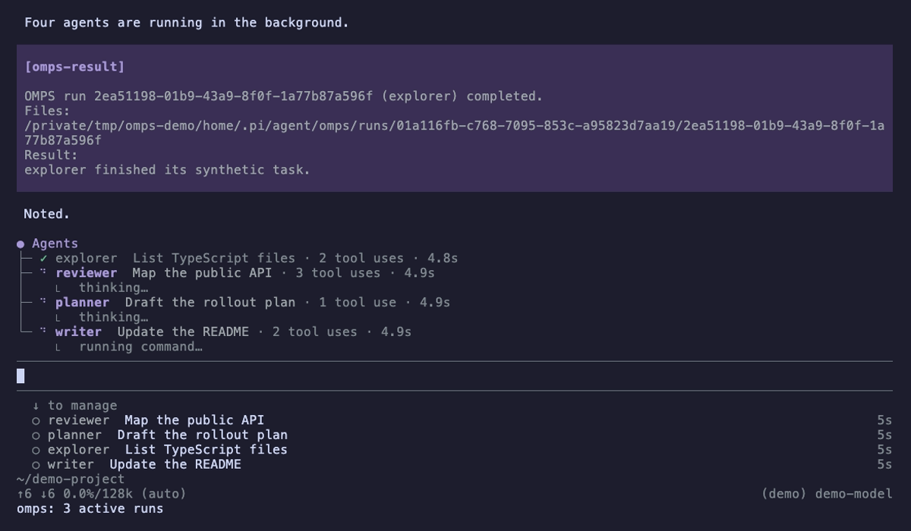

# OMPS: Opinionated Modular Pi Subagents


OMPS lets Pi hand work to subagents. Each subagent is a normal Pi child process that runs in the background.
You choose the agent names, the persona text and the tools each agent may use. OMPS ships no agents of its own.



- **Live agent tree.** The `● Agents` tree above the editor shows each running agent, its task and its elapsed time. `/omps fleet` collapses or expands it.
- **Inspector.** `/omps inspect` opens any run, including nested ones, with its answer and saved output.
- **Tool guard.** A child can call only the tools you list. OMPS checks this before the task reaches the child.
- **Results.** The answer arrives in the parent session as a message when the child finishes. Long answers fold.
- **Limits.** You set how many children each parent may run at once and how deep they may nest.
- **At-mention launch.** Type `@reader Summarise the README` in the Pi terminal to start the agent `reader` directly.
- **Settings menu.** `/omps-settings` edits limits, display and shortcuts.

## Install

1. Run `pi install npm:om-pi-subagents`.
2. Run `/reload` in Pi.
3. Run `/omps list`. A new install answers `No personas mapped.`

Update, pin a version or load a local copy: [How to install](docs/INSTALL.md).

## Add your first agent

You create two files in `~/.pi/agent/omps/`. A package update never touches them.

```text
~/.pi/agent/omps/
├── config.yaml
└── personas/
    └── reader.md
```

The persona is the agent's instructions, `personas/reader.md`:

<!-- docs-test: persona -->

```markdown
You read files and answer questions about them.
Give short answers. Name the file for every claim.
```

The mapping is `config.yaml`:

<!-- docs-test: yaml -->

```yaml
version: 1
agents:
  reader:
    persona: ./personas/reader.md
    tools: [read, grep, find, ls]
    thinking: off
```

Run `/omps list`. It now shows `reader`. Then run it:

```text
/omps run reader Summarise the README
```

You can also ask the parent model to call the `omps` tool, or type `@reader Summarise the README`.
Edits to the YAML apply at the next launch. Every field is listed in [Set up agents](docs/SETUP.md).

## Parallel and nested agents

By default each parent runs one child at a time and children cannot start children. Add `limits` to change that:

<!-- docs-test: limits -->

```yaml
version: 1
limits:
  maxConcurrentRuns: 4
  maxDepth: 3
agents: {}
```

The root is depth zero, so depth 3 allows grandchildren and great-grandchildren.
A child may delegate only when its mapping lists `omps` in `tools` and names its targets in `delegates`:

```yaml
agents:
  builder:
    persona: ./personas/builder.md
    tools: [read, edit, write, bash, omps]
    thinking: high
    delegates: [writer]
```

OMPS refuses any other launch from `builder` before it starts a process.
Four slots to depth 3 can reach `4 + 16 + 64 = 84` descendants. Give concurrent writers separate worktrees.

## Automatic delegation

When the `omps` tool is active, Pi gives the model short rules. They tell it to hand bounded, separable parts of big tasks to your mapped agents. Simple tasks stay local.
The model decides each launch, so the rules do not guarantee it. To opt out, say `Work locally; do not use subagents`.
See [How to use](docs/USAGE.md#prompt-scope-and-host-versions).

## Safety

The tool list is a guard inside trusted Pi code. It is not an operating-system sandbox.

- An agent with `bash`, `powershell`, `write` or `edit` changes files with your permissions. `/omps list` marks it `write-capable`. Run it in a worktree.
- Write each tool by its exact name. OMPS has no wildcards.
- Only list extensions you trust. They run in the child.

## Optional: todo and memory

[om-pi-todo](https://www.npmjs.com/package/om-pi-todo) and [OMMS (`om-memory-system`)](https://www.npmjs.com/package/om-memory-system) are off for every agent.
To turn one on, run `/omps-settings`, choose **Agent capabilities**, pick the agent, then **Todo** or **Memory**, and confirm the change.
OMPS installs no package. A child never sees or changes the parent's tasks. Details: [Todo and memory](docs/INTEGRATIONS.md).

## Not supported

- Calls to the old `subagent` tool and workflow scripts.
- Councils, scheduling, remote workers, automatic worktrees and provider fallback.
- Resuming a run after a restart.

## More

- [How to install](docs/INSTALL.md): install, update, pin and migrate.
- [Set up agents](docs/SETUP.md): every YAML field, tools, skills, shortcuts.
- [How to use](docs/USAGE.md): run agents, read results, inspect, cancel.
- [Todo and memory](docs/INTEGRATIONS.md): use om-pi-todo and OMMS in agents.
- [How to uninstall](docs/UNINSTALL.md): remove OMPS and your own files.
- [Maintaining OMPS](docs/MAINTAINING.md): development, tests and releases.
- [Architecture decisions](docs/adr/ADR_README.md)

The `● Agents` tree and the agent list are adapted from [tintinweb/pi-subagents](https://github.com/tintinweb/pi-subagents) under its MIT licence. OMPS does not import that package. See [third-party notices](THIRD_PARTY_NOTICES.md).
