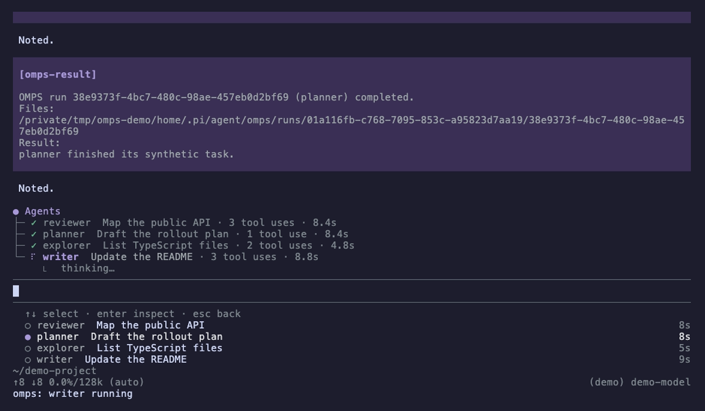
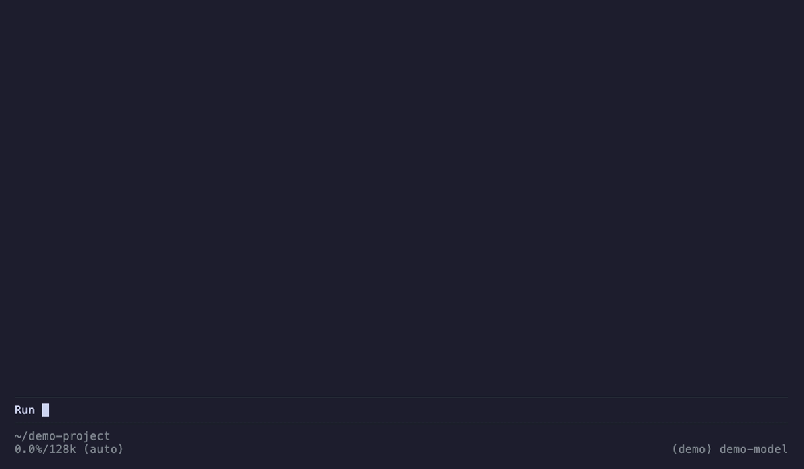

# OMPS: Opinionated Modular Pi Subagents


OMPS runs a subagent as a normal Pi child process. You decide the agent
names, the persona text, and the tools each agent may use. All of it lives in
one YAML file and plain Markdown files. OMPS ships no agents of its own.

- The parent gets the `omps` tool, `/omps` commands and an operator-only `/omps-settings` menu.
- Each run is one child Pi process in the background.
- YAML limits set each parent's direct-child capacity and maximum nesting depth. Both default to one.
- YAML `ui` settings set visible rows (default 5), the fleet view (default `expanded`) and optional view shortcuts.
- The result arrives as a follow-up message when the child finishes.

The `● Agents` tree and the navigation list are adapted from
[tintinweb/pi-subagents](https://github.com/tintinweb/pi-subagents) under its MIT licence.
OMPS does not import or need that package. Its own runtime, settings and inspection stay separate.

## Features


The screenshot is a real Pi 1.0.4 session with four real child Pi processes. A local fake model drives
the agents, so the task names and answers are synthetic. `scripts/readme-demo.tape` records it with
[vhs](https://github.com/charmbracelet/vhs).

- **Agent tree.** The `● Agents` tree above the editor shows each running agent with a spinner, its task,
  its tool-use count, the elapsed time and what it does now. Finished agents show `✓`, `✗` or `■` for a
  short time. The tree is adapted from [tintinweb/pi-subagents](https://github.com/tintinweb/pi-subagents)
  under its MIT licence.
- **Arrow-key list.** From an empty prompt, press Down to select an agent in the list below the editor.
  Press Enter to inspect it and Escape to go back. No modifier keys are needed.
- **Inspector.** `/omps inspect` opens the whole run tree, including nested agents, with live tools and
  saved output.
- **Isolated children.** Each agent runs as its own Pi process. Before the task is sent, OMPS checks that
  the child loaded its tool guard, its tools, its model and its working directory. The guard refuses
  any tool the mapping does not approve.
- **Limits.** YAML limits set how many direct children each parent may run at once and how deep agents
  may nest.
- **Saved runs.** Each run keeps its task, events, output and status in a private run folder.
- **Settings.** `/omps-settings` edits the limits, the fleet view, the shortcuts and the optional
  capabilities of each agent.
- **Short agent list.** `/omps list` shows one line per agent, such as `reader: 4 tools (read-only)`.
  The model still receives every tool name.



<details>
<summary>Recording of the whole run</summary>



</details>

## Works with om-pi-todo and OMMS

Both [om-pi-todo](https://www.npmjs.com/package/om-pi-todo) and OMMS (`om-memory-system`) are optional.
They are off for every new agent. To turn one on for an agent:

1. Run `/omps-settings`.
2. Choose **Agent capabilities**, then the agent, then **Todo** or **Memory**.
3. Select **Enable** and confirm the exact changes to that agent's tools and extensions.

The change applies to the next launch. OMPS installs no package.

**Todo.** Each child starts with its own empty task list in normal mode. It never sees or changes the
parent's tasks, and it never ticks the parent's OpenSpec checkboxes. The parent's todo widget and the
OMPS tree both show above the editor without changing each other. After you check a child's saved result, update the parent's tasks yourself.

**Memory.** OMMS keeps its own recall, tools and capture. OMPS never reads, copies or changes memory
stores. A child gets the `memory` tool, and the OMMS skill if mapped, only when you enable it. That
child then works in the same project scope as OMMS normally uses, under its own session. The shipped
OMPS skill guides the parent to search memory before it delegates and to pass on only verified context.

## What to read

| You want to                                                     | Read                                  |
| --------------------------------------------------------------- | ------------------------------------- |
| Install, update or pin a version                                | [How to install](docs/INSTALL.md)     |
| Create agents: the YAML file, persona files and where they live | [Set up agents](docs/SETUP.md)        |
| Run an agent, read progress and results                         | [How to use](docs/USAGE.md)           |
| Remove OMPS and the files you created                           | [How to uninstall](docs/UNINSTALL.md) |

A new install has no agents. Read [Set up agents](docs/SETUP.md) before you run anything.

## Set up

1. Install the package:

   ```sh
   pi install npm:om-pi-subagents
   ```

2. Run `/reload` in Pi.
3. Run `/omps list`. A new install answers `No personas mapped.`

Pi supplies its own packages. The one runtime dependency is `yaml`. To load a
local checkout instead, see [installation](docs/INSTALL.md).

## Add your first agent

Each agent needs a Markdown persona and a YAML mapping. Both live in your Pi
agent directory, `~/.pi/agent/`, so package updates never touch them. Persona
paths are relative to the mapping file, inside `omps/`:

```text
~/.pi/agent/omps/
├── config.yaml
├── personas/
│   └── reader.md
└── runs/<session-id>/<run-id>/
```

**Breaking upgrade:** move existing settings and personas with the
[migration guide](docs/INSTALL.md#move-settings-into-the-omps-folder).
When only the old registry exists, OMPS blocks listing, launches and settings saves
with migration commands. `OMPS_REGISTRY` can explicitly select another file.

You create both. The install makes neither the mapping file nor the persona
folder. Keep persona files in `~/.pi/agent/omps/personas/`. OMPS
reads only the files that your `persona:` lines name. For the full explanation,
see [Set up agents](docs/SETUP.md#persona-persona-folder-and-omps-the-difference).

Persona file `~/.pi/agent/omps/personas/reader.md`:

<!-- docs-test: persona -->

```markdown
You read files and answer questions about them.
Give short answers. Name the file for every claim.
```

Mapping file `~/.pi/agent/omps/config.yaml`:

<!-- docs-test: yaml -->

```yaml
version: 1
agents:
  reader:
    persona: ./personas/reader.md
    tools: [read, grep, find, ls]
    thinking: off
```

Then run `/omps list`. The list now shows `reader`. No reload is needed.
For every field, persona tips and common errors, see [Set up agents](docs/SETUP.md).

Start a run with `/omps run reader Summarise the README`, or ask the parent
model to call the `omps` tool.

### Parallel and nested runs

Add `limits` beside your existing `agents` mapping. Preserve the agents you already defined.
This empty-mapping example shows four direct slots per parent and a maximum depth of three:

<!-- docs-test: limits -->

```yaml
version: 1
limits:
  maxConcurrentRuns: 4
  maxDepth: 3
agents: {}
```

The root is depth zero. Depth three allows children, grandchildren and great-grandchildren.
A child can delegate only when its mapping approves the exact `omps` tool.
Each target keeps its own tools, so delegation can reach write-capable targets.

Limits have no additional fixed ceiling. Four slots through depth three can create
`4 + 16 + 64 = 84` descendants. Use separate safe worktrees for concurrent writers.
See [configured limits](docs/USAGE.md#configured-limits-and-nesting) for inherited ceilings and cancellation.

For operational guidance in Pi, run `/skill:om-pi-subagents`.
Approved children need an explicit skill path; see [setup](docs/SETUP.md#skills-and-extensions).

### Operator settings

Run `/omps-settings` in Pi, or through an RPC client that supports native dialogs.
`/subagents-settings` is an alias of the same menu. Select a setting, enter a value,
then confirm the shown value and save destination:

| Setting                             | Accepted values                                                 | Save destination                        |
| ----------------------------------- | --------------------------------------------------------------- | --------------------------------------- |
| Maximum nesting depth               | Safe integers of at least 0; root depth 0                       | `limits.maxDepth` in the registry YAML  |
| Parallel direct children per parent | Safe integers of at least 1                                     | `limits.maxConcurrentRuns` in that YAML |
| Visible agents                      | Safe integers from 1 to 256; default 5                          | `ui.maxVisibleAgents` in that YAML      |
| Fleet view                          | `expanded`, `collapsed` or `off`; default `expanded`            | `ui.fleetView` in that YAML             |
| Fleet list shortcut                 | A Pi key specification such as `alt+o`, or `off`; default `off` | `ui.toggleKey` in that YAML             |
| Inspection shortcut                 | A Pi key specification such as `alt+i`, or `off`; default `off` | `ui.inspectKey` in that YAML            |

`OMPS_REGISTRY` selects the registry when set. The menu shows its resolved path.
Execution limits and UI settings stay in that one YAML file. OMPS leaves todo preferences
and Pi's `settings.json` untouched. Shortcut values are lowercase Pi key specifications.
Ctrl+I and Tab are refused because legacy terminals send one byte for both, and a key already
bound to an effective built-in action is refused with guidance. Both shortcuts can be `off`.

Shortcuts bind when an interactive session starts. A saved shortcut needs `/reload` before it
becomes active; the menu shows the saved and the active binding until then. Visible-agent and
limit changes take effect without a reload, and the display repaints at once.

Older OMPS versions kept visible agents in `<config-dir>/pi-subagents/config.json`. That file
is now a read-only fallback: when YAML omits `ui.maxVisibleAgents`, its valid value still applies
and the menu labels its source. The menu offers a confirmed import that writes the value into
YAML. YAML wins once it declares the field. OMPS no longer writes the legacy file.

Cancelling an input or declining confirmation leaves that setting unchanged.
Earlier confirmed saves remain in effect. Creating a missing registry requires confirmation;
it starts with `agents: {}`. OMPS creates `omps/` with mode `0700` and `config.yaml`
with mode `0600`, without creating a persona folder. Malformed files must be corrected before saving.
Conflicting edits are rejected: reopen settings to load the newer values.

Saved limits apply to fresh launches. Existing runs continue, and an existing branch keeps its inherited depth ceiling.
Depth zero disables new launches. Raising per-parent capacity can multiply process and provider load.
See [operator settings](docs/USAGE.md#operator-settings) for the procedure and write-failure guidance.

Memory and Todo are off for new agent mappings. Existing explicit mappings stay in effect.
In `/omps-settings`, choose **Agent capabilities**, then an agent and Memory or Todo.
Select **Enable**, enter the installed package folder or its published Pi extension entry,
and confirm the exact `tools` and `extensions` changes. Memory can also map its shipped
skill. Approval for `memory` covers its whole tool, including write and portability modes.
**On (configured)** reports mapped resources, not backend health. **Partial** needs an
explicit correction; inspect the agent's lists before disabling an unrecognised wrapper.
**Disable** removes the recognised extension, mapped skill and tool for future launches.
No package is installed, no parent extension setting changes, and active children keep
what they started with. See [optional child capabilities](docs/USAGE.md#optional-child-capabilities).

### Compact fleet and inspection

The `● Agents` tree above the editor shows every running direct agent with no key press.
Its look is adapted from [tintinweb/pi-subagents](https://github.com/tintinweb/pi-subagents)
(MIT; see [third-party notices](THIRD_PARTY_NOTICES.md)). Each running agent has two lines:
a spinner, the name, the task, the tool-use count and the elapsed time, then what it is doing
now. The tree uses at most 12 lines, running agents first:

```text
● Agents
├─ ⠹ reviewer  Map the API · 3 tool uses · 4.2s
│    ⎿  searching…
├─ ⠹ planner  Draft the rollout · 1.9s
│    ⎿  thinking…
└─ ✓ explorer  List TypeScript files · 2 tool uses · 3.1s
```

A list below the editor shows the same runs for navigation. From an empty prompt:

1. Press Down to select the first agent.
2. Press Up or Down to move. Press Enter to inspect the selected agent.
3. Press Escape to return to the prompt. The runs continue.

Outside the list, Up and Escape keep their normal Pi actions. Every active root stays
reachable; the list shows `ui.maxVisibleAgents` rows (default 5) with `↑ N more` and
`↓ N more` markers. `/omps inspect` still opens runs after they leave both widgets.

Set `ui.fleetView` to `collapsed` for the tree heading only, or `off` to hide both widgets.
`/omps fleet` switches between expanded and collapsed for the current session.

Each launch leaves one compact acknowledgement row in the transcript. Pi's native expansion action,
`app.tools.expand` with Ctrl+O by default, reveals the acknowledgement text only. It never creates a
second live tree. The complete retained hierarchy lives in the inspection modal:

1. Run `/omps inspect` to select any retained node in this session.
2. Use arrows, then Enter, to read its saved task and output.
3. Press Escape to close the viewer while the run continues.

`/omps inspect <run-id>` opens a selected node directly. Fullscreen Pi also supports row clicks.
Regular mode uses the keyboard. Supported RPC clients receive bounded text without terminal components.
Only an immediate parent can use status or cancellation for a descendant.

Tasks and outputs can contain sensitive text. Reads are limited to 64 KiB per selected evidence file;
truncated output shows its saved location. See [inspection](docs/USAGE.md#agent-trees-and-inspection).

### YAML fields

| Field        | Required | Meaning                                                            |
| ------------ | -------- | ------------------------------------------------------------------ |
| `version`    | yes      | Must be `1`.                                                       |
| `limits`     | no       | `maxConcurrentRuns` and `maxDepth`; omitted fields default to one. |
| `agents`     | yes      | A mapping. Use `{}` for no agents.                                 |
| `<name>`     | -        | The agent name. Use `[a-z][a-z0-9-]{0,63}`. No name is special.    |
| `persona`    | yes      | Path to a Markdown file inside this directory. No frontmatter.     |
| `tools`      | yes      | Exact tool names. `[]` grants no tools. No wildcards.              |
| `model`      | no       | `provider/id`. The default is the parent's model.                  |
| `thinking`   | yes      | `off`, `minimal`, `low`, `medium`, `high`, `xhigh`, or `max`.      |
| `skills`     | no       | Paths to `SKILL.md` files. Paths may start with `~/`.              |
| `extensions` | no       | Paths to trusted extensions. See "Provider extensions".            |

Personas cannot resolve into `omps/runs/`, including through symbolic links. Run evidence can contain model output.
OMPS rejects unknown fields, duplicate keys, aliases, and custom YAML tags.
A bad file stops every launch until you fix it. OMPS never runs on old
settings after a failed load.

Every agent needs explicit `thinking`. Add a supported value to older mappings
before launching. OMPS uses that value even when the parent has a different
thinking level. An empty `agents: {}` registry remains valid.

Edits take effect at the next launch. `/omps list` reloads the file. A run
that already started keeps the settings it started with.

## Tools and MCP

Write each tool by its exact name. Native MCP tools are named
`mcp__<server>__<tool>`. The server name comes from your `mcp.json`. On Pi 1.0
and newer, hyphens in the name become underscores. See
[Tools](docs/SETUP.md#tools).

```yaml
tools:
  - read
  - tool_search
  - mcp__context7_mcp__resolve_library_id
  - mcp__context7_mcp__query_docs
```

- Add `tool_search` if the agent must find deferred MCP tools.
- The old `mcp` proxy tool no longer exists. A persona that lists `mcp` fails
  before the task reaches a model, and the error names the native form.
- Listing a tool does not load it. The server must also be configured and
  connected in the child.

## The permission boundary

Before it sends the task, OMPS checks that the child loaded its guard, that
every approved tool exists, that the model resolves, and that the working
directory is right. It then blocks, at the moment of the call, every tool that
is not on the list. This covers direct calls, tools found with `tool_search`,
and calls made through another tool. A blocked call fails the run.

Only the parent may prompt a child. The guard refuses any other prompt, such as
one a trusted extension sends, before Pi starts a model run. A refused prompt
before readiness stops the launch. A refused prompt later fails the run.

This is a rule inside trusted Pi code. It is **not** an operating-system
sandbox.

- A tool name does not prove what the tool does. An MCP tool marked read-only
  gets no extra trust. Only the names you list are allowed.
- `bash`, `powershell`, `write`, and `edit` can change files. `/omps list`
  marks an agent that has one of them as `write-capable`.
- An agent with a write-capable tool runs with your file permissions. Start it
  in a feature worktree or another directory that is safe to change.
- Sessions have separate direct-child slots. OMPS sets no combined machine or provider budget.
- `/omps list` marks approved `omps` targets as `delegation-capable`, including their ability to select write-capable targets.

## Provider extensions

A child loads its guard, required Pi built-ins and explicitly mapped resources.
OMPS also loads managed delegation or todo setup when those tools are approved.
Ambient resources stay disabled. For a custom provider, list the extension that registers it:

```yaml
model: my-provider/my-model
extensions: [~/.pi/agent/extensions/my-provider/index.ts]
```

Only list code you trust. It runs in the child with your permissions.
If the model is not known to the child, the run fails before the task is sent.
OMPS does not choose another model for you.

## Reading progress

Run `/omps` without arguments to see current-session status. Whitespace-only
arguments also show status. A fresh session answers `No runs in this session.`
Use `/omps status <run-id>` for one run, or `/omps cancel <run-id>` to stop it.

The `● Agents` tree appears above the editor and the navigation list below it. A completed
run stays in the tree until the next parent turn and for at least 4 seconds. A failed or
cancelled run stays for two parent turns. The list keeps a finished run for 4 seconds.
With `ui.fleetView: collapsed`, the tree shows only its heading and the running count.
Cancellation sends no automatic result message.

The tree shows task labels, tool-use counts, elapsed times, active tool names and the first
line of the agent's visible answer so far. It never shows tool arguments, raw tool results,
thinking or stderr. Terminal controls are removed from displayed text. The full saved answer
and the result message stay on their existing paths. Clients without widget support can use
`/omps` or the status line. OMPS opens no extra Orca terminals.

## Run files

OMPS saves each run in `~/.pi/agent/omps/runs/<session-id>/<run-id>/`. The
directory and the files are private to your user.

| File                         | Content                                                                                       |
| ---------------------------- | --------------------------------------------------------------------------------------------- |
| `config.json`, `persona.md`  | The settings and persona the run started with, and the task.                                  |
| `status.json`                | State, timestamps, error, child process id, depth, ownership and effective limits.            |
| `events.jsonl`, `stderr.log` | Streamed evidence. Known credential fields are redacted.                                      |
| `output.md`                  | The final answer. Partial text from a failed or cancelled run starts with `> PARTIAL OUTPUT`. |
| `notification.json`          | Whether the result message reached the parent.                                                |

Personas, tasks, and outputs can hold sensitive text. OMPS never deletes run
directories. Remove old ones yourself.

## Run states

`starting`, `running`, `stopping`, `completed`, `failed`, `cancelled`.

A run is `completed` only when all of these are true: the child accepted the
task, it settled, the last assistant message is a normal answer, the output is
saved, the child exited cleanly, and cleanup is confirmed. Output that exists
after an error does not make a run pass.

- Start-up has 30 seconds. A whole run has 30 minutes.
- `/omps cancel <run-id>` stops that owned subtree, including nested agents, without cancelling unrelated siblings.
- A delegating child waits for owned runs and result-delivery attempts before final settlement.
- `om-pi-todo` and OMMS are optional and off for new child mappings. Child tasks stay local and never update the parent's OpenSpec checkboxes.
- Reload, quit, or a new session stops active runs. No child outlives its
  parent.
- If OMPS cannot confirm that all processes stopped, the run fails and the
  session cannot start another until you stop them by hand and reload.

## Not supported

These are outside this version:

- Calls to the old `subagent` tool and workflow scripts.
- Councils, scheduling, remote workers, automatic worktrees, and provider
  fallback.
- Resuming a run after a restart.

Skills that promise these features need edits before you use them with OMPS.

## Remove OMPS

1. Stop active runs with `/omps cancel <run-id>`, or quit Pi.
2. Run `pi remove npm:om-pi-subagents`.
3. Run `/reload`.

Run files stay in `~/.pi/agent/omps/runs/` until you delete them. Your mapping
in `~/.pi/agent/omps/config.yaml` and your persona folder also stay. You
created them, so you remove them. For the steps, see
[How to uninstall](docs/UNINSTALL.md#remove-your-own-files-optional).

## Release (maintainers)

Releases go to npm as `om-pi-subagents`. [Release Please](https://github.com/googleapis/release-please) prepares each one. You never edit the version or the changelog by hand.

1. Write commits and pull request titles in the [Conventional Commits](https://www.conventionalcommits.org) style: `feat:`, `fix:`, `perf:`, `docs:`. Add `!` for a breaking change, for example `feat!:`.
2. Merge to `main`. Release Please opens or updates a pull request called "chore(main): release X.Y.Z". It bumps `version` in `package.json` and writes `CHANGELOG.md`.
3. Read that pull request. Check the version and the changelog text. Its CI checks run.
4. `release-auto-merge.yml` waits for successful `CI` from a same-repository `pull_request` run, then checks the release output. The release App squash-merges the tested SHA with `--match-head-commit`. Release Please tags the commit and creates a GitHub release.
5. The publish job runs the full gate on that exact commit, then **stages** the version on npm. It captures npm's stage UUID and adds the exact approval command to the GitHub release. The version is not installable yet.
6. As the human maintainer, run `bun run release:approve` from the repository with two-factor authentication. In Pi, use `! bun run release:approve`.

   The helper reads the captured UUID from the release note. If capture failed, the note gives manual-list guidance:

   ```sh
   npm stage list om-pi-subagents
   bun run release:approve <stage-uuid>
   ```

   Select the UUID for that version. You can instead run the note's exact `npm stage approve` command,
   or use the Staged tab at https://www.npmjs.com/package/om-pi-subagents. Reject with `npm stage reject <stage-id>`.

### Guarded release pull request merge

The workflow loads the trusted `scripts/release-pr-guard.mjs` from `main`. It never checks out or executes pull request code.
The guard requires the release bot's pull request targeting `main`, bot-authored commits signed by GitHub, and an unchanged tested head.
Only `package.json`, `.release-please-manifest.json` and `CHANGELOG.md` may change.
Both JSON files must change only their versions and agree; the changelog must contain no deletions.
A guard failure stops the merge. The App token lets the merge start the Release workflow.
GitHub's native `allow_auto_merge` setting is not required.

After this workflow reaches `main`, rerun the existing release pull request's `pull_request` CI run to trigger it.
Leave the pull request source unchanged.

The Release workflow comments on the merged release pull request and mentions the repository owner after staging.
Enable email notifications for GitHub `@mentions` to receive that comment by email.
If the release fails before staging, it adds a failure notice to the release and comments with the failed run link.
Fix the failed step, then rerun the Release workflow. Human approval with 2FA remains required for npm publication.

### Human-run approval helper

Run `bun run release:approve` from this repository checkout. In Pi, the human can use `! bun run release:approve`.
The `!` prefix runs a shell command; it is not part of the package script. Agents and CI must never run real approval.

Prerequisites: Bun, GitHub CLI (`gh`) with repository access, npm 11.15 or newer, and an npm account with approval rights.
Check `gh auth status` and `npm whoami` before starting. npm owns login and the two-factor authentication prompt.
The helper is repository tooling and is excluded from the installed npm package.

1. Run `bun run release:approve` to discover the stage UUID from the newest GitHub release note.
2. If discovery fails, run `npm stage list om-pi-subagents` and select the matching pending version.
3. Retry with `bun run release:approve <stage-uuid>`.
4. After confirmed registry visibility, run the printed `pi update npm:om-pi-subagents` command when ready.
5. Restart Pi or run `/reload` after updating.

The helper displays the stage before approval and polls npm with fresh reads, at most 30 attempts.
`OMPS_REPO` overrides the GitHub repository; `OMPS_RELEASE_POLL_SECONDS` changes the five-second polling interval.
Failed approval stops before polling and gives login guidance. After a visibility timeout, check npm status before retrying.
An already published version needs no further approval. The helper performs no Pi update or plugin/channel operation.

What each commit type does before version 1.0.0:

| Commit                                      | Version change                    |
| ------------------------------------------- | --------------------------------- |
| `fix:`, `perf:`                             | Patch, for example 0.1.0 to 0.1.1 |
| `feat:`                                     | Minor, for example 0.1.0 to 0.2.0 |
| `feat!:` or a `BREAKING CHANGE:` footer     | Minor. After 1.0.0 it is major.   |
| `docs:`, `style:`, `test:`, `chore:`, `ci:` | No release                        |

### One-time setup

No npm token is used. npm trusts the release workflow through OIDC.

1. Publish the first version by hand, then tag it and create its GitHub release, so Release Please counts from it.
2. Create the release GitHub App with the manifest helper. It saves `RELEASE_APP_ID` and `RELEASE_APP_PRIVATE_KEY` as repository secrets. No key file is created.
3. Create the `npm-publish` environment, limited to the `main` branch.
4. Add the trusted publisher:

   ```sh
   npm trust github om-pi-subagents --file release.yml --repo cmdaltctr/om-pi-subagents --env npm-publish --allow-stage-publish
   ```

5. Switch the workflow on: `gh variable set RELEASE_PLEASE_ENABLED --body true`.

## Development tooling

Use Bun 1.4.2 and Node.js 22.12 or newer. Run these commands from the repository root:

```sh
bun install
bun run setup:host
bun run ci
```

Oxlint checks code with warnings denied. Oxfmt formats files with tabs and a
120-character print width. Husky installs the pre-push hook through `prepare`.

Host setup uses Bun to fetch Pi 0.99.1 and typebox 1.3.27 into `.pi-host/`.
It includes `@earendil-works/pi-ai`, `@earendil-works/pi-coding-agent`,
`@earendil-works/pi-tui` and `typebox`. Host packages remain outside this
project's `node_modules`. `bunfig.toml` sets `peer = false` to keep them there.
The extension declares its directly used host packages as peers.
Vite is a direct development dependency because Vitest needs it while automatic
peer installation is disabled.
`@fission-ai/openspec` 1.14.0 is a pinned development dependency for the real
`om-pi-todo` OpenSpec compatibility tests. `bun install` supplies its CLI locally;
production installs do not require it.

> [!CAUTION]
> **Known high-severity vulnerability in a development dependency**
> OpenSpec 1.14.0 brings in `braces@3.0.3` through `fast-glob` and `micromatch`.
> [GHSA-vfj7-8cjw-p6xm](https://github.com/advisories/GHSA-vfj7-8cjw-p6xm) allows deeply nested brace patterns to crash the OpenSpec CLI.
> No patched release exists as of 5 October 2026. Use only trusted schema patterns and repositories.
> The maintainer accepts this risk for personal development and compatibility tests.
> `bun run audit` checks production dependencies without exceptions, then checks all dependencies with this advisory excluded.
> Other advisories still fail the audit. Run `bun audit` to see the accepted finding.
> Remove the exception when a patched dependency becomes available.

| Purpose                               | Command                   |
| ------------------------------------- | ------------------------- |
| Fetch pinned host packages and Pi CLI | `bun run setup:host`      |
| Human approval of a staged release    | `bun run release:approve` |
| Format files                          | `bun run format`          |
| Check formatting                      | `bun run format:check`    |
| Lint with warnings denied             | `bun run lint`            |
| Apply lint fixes for review           | `bun run lint:fix`        |
| Check types                           | `bun run typecheck`       |
| Run tests                             | `bun run test`            |
| Check dependency vulnerabilities      | `bun run audit`           |
| Format check, lint, types, then tests | `bun run ci`              |
| Check a fresh clone of committed HEAD | `bun run ci:clean`        |
| Install the Husky hooks               | `bun run prepare`         |

`bun run ci:clean` needs a git commit. It installs from the lockfile with
`HUSKY=0` in a temporary clone and runs `bun run ci`. Uncommitted changes are
excluded. Host packages already downloaded locally are reused.
The clone sets `OMPS_PI_BIN` to the pinned host CLI, matching GitHub Actions.

The executable `.husky/pre-push` runs host setup followed by `bun run ci:clean`.
GitHub Actions runs the same checks and a separate audit job on pushes and
pull requests. Its actions use full commit SHA pins.

Tests start real Pi 0.99.1 children with a local fake model and local MCP server.
They use no live model or real credential. CLI-dependent suites skip when Pi is
missing; independent tests still run.

Tests use `OMPS_PI_BIN` first, then `.pi-host/node_modules/.bin/pi`, then `pi`
on PATH. Set an explicit override only when testing another installation.
`OMPS_REGISTRY` selects another mapping file, for tests or for a second setup.

Read [AGENTS.md](AGENTS.md) before changing the project.

## Documentation

- [How to install](docs/INSTALL.md)
- [Set up agents](docs/SETUP.md)
- [How to use](docs/USAGE.md)
- [How to uninstall](docs/UNINSTALL.md)
- [Architecture decisions](docs/adr/ADR_README.md)
- [Technical decisions](docs/tdr/TDR_README.md)
